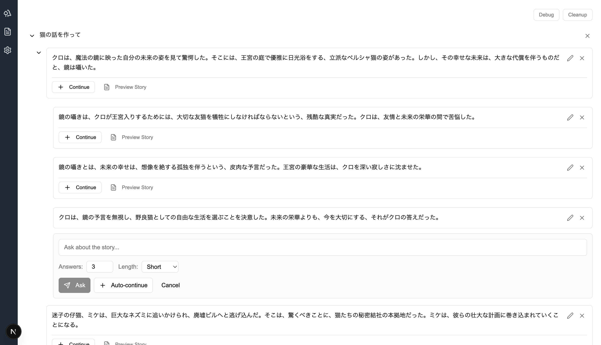

# Yourlit - Interactive AI Story Tree Generator

One question. Infinite paths.  
Yourlit grows stories like branches from your questions.

**Yourlit** is an interactive storytelling application that lets you create branching narrative trees using AI.  
Build rich, multi-path stories—each question you ask leads to new twists, outcomes, and possibilities.

## Screenshots

### Tree View - Interactive Story Branching

*Create branching narratives with AI-generated responses. Each node can expand into multiple story paths.*

### Story Management - Drafts and Versions

*Save story threads as drafts and create multiple versions with different AI instructions.*

## Features

### 🌳 Interactive Story Trees
- **Branching Narratives**: Create stories with multiple paths and outcomes
- **AI-Powered Responses**: Generate creative story continuations using OpenAI or Gemini
- **Tree Visualization**: Navigate your story as an expandable tree structure
- **Context-Aware Generation**: AI maintains narrative coherence using conversation history

### ✏️ Story Management
- **Response Editing**: Edit AI-generated responses to perfect your story
- **Draft Saving**: Save story threads as drafts for later development
- **Version Creation**: Generate multiple versions of stories with different instructions
- **Copy & Export**: Easy copying of story content to clipboard

### 🤖 AI Integration
- **Multi-Provider Support**: Works with both OpenAI and Gemini APIs
- **Customizable Responses**: Adjust response length (short/medium/long) and count (1-5)
- **Multi-Language Support**: Generate stories in multiple languages
- **Smart Prompting**: Specialized prompts for story continuation vs. story rewriting

### 🎨 User Interface
- **Modern Design**: Clean, minimalist interface using shadcn/ui components
- **Responsive Layout**: Works on desktop and mobile devices
- **Activity Bar Navigation**: Easy switching between Trees, Stories, and Settings
- **Real-time Generation**: Live feedback during AI response generation

## Getting Started

### Prerequisites
- Node.js 18+ 
- npm or yarn
- OpenAI API key or Gemini API key

### Installation

1. **Clone the repository**
   ```bash
   git clone <repository-url>
   cd yourlit
   ```

2. **Install dependencies**
   ```bash
   npm install
   ```

3. **Start the development server**
   ```bash
   npm run dev
   ```

4. **Open your browser**
   Navigate to `http://localhost:3000`

### Configuration

1. **Set up API Keys**
   - Go to Settings page in the application
   - Enter your OpenAI API key (starts with `sk-`) or Gemini API key
   - Select your preferred AI provider
   - Choose default response language and settings

2. **Environment Variables** (Optional)
   Create a `.env.local` file for default settings:
   ```env
   # Not required - settings are managed in-app
   ```

## Usage

### Creating Your First Story Tree

1. **Start a New Tree**
   - Click "Trees" in the activity bar
   - Click "Create New Tree" or start typing a question
   - Your initial question becomes the root of your story tree

2. **Generate AI Responses**
   - Click "Continue" on any story node
   - Enter a question or prompt
   - Adjust response count and length as needed
   - Click "Ask" to generate AI responses

3. **Build Your Tree**
   - Each AI response becomes a new branch
   - Click "Continue" on any response to expand further
   - Edit responses by clicking the edit icon
   - Delete unwanted branches with the delete button

### Managing Stories

1. **Save Story Drafts**
   - Click "Preview Story" on any story node
   - Click "Save as Story" to save the conversation thread
   - Access saved stories in the "Stories" section

2. **Create Story Versions**
   - Open a saved story in the Stories section
   - Click "Create Version" 
   - Enter instructions (e.g., "Make it more dramatic", "Add dialogue")
   - AI will rewrite the entire story following your instructions

### Advanced Features

1. **Auto-Continue**
   - Use "Auto-continue" button for AI to automatically extend the story
   - No prompt needed - AI continues the narrative naturally

2. **Context Building**
   - AI maintains conversation history for coherent storytelling
   - Each branch remembers its path from the root

3. **Data Management**
   - Use "Cleanup" button to clean localStorage data
   - Use "Debug" button to inspect tree structure

## Project Structure

```
yourlit/
├── app/
│   ├── trees/           # Main story tree functionality
│   │   ├── TreeNodeComponent.tsx    # Individual tree node rendering
│   │   ├── ai-game-tree.tsx         # Main tree interface
│   │   ├── types.ts                 # TypeScript interfaces
│   │   └── constants.ts             # App constants
│   └── lib/                  # Utilities and services
│       ├── settings.ts              # App settings management
│       ├── draftsStorage.ts         # Story persistence
│       ├── storyGenerationService.ts # AI generation logic
│       └── dateUtils.ts             # Formatting utilities
├── components/
│   ├── ui/                   # shadcn/ui components
│   ├── drafts/              # Story management components
│   │   ├── DraftsList.tsx
│   │   ├── DraftViewer.tsx
│   │   ├── VersionsList.tsx
│   │   └── VersionCreationModal.tsx
│   ├── ActivityBar.tsx      # Main navigation
│   ├── SettingsPage.tsx     # Settings interface
│   ├── TreesPage.tsx        # Tree management
│   └── StoriesPage.tsx       # Story management
├── actions.ts               # Server actions for AI calls
└── README.md
```

## API Integration

### OpenAI Integration
- Uses GPT-3.5-turbo model
- Supports conversation context
- Configurable temperature and token limits
- Proper error handling for rate limits and API issues

### Gemini Integration  
- Uses Gemini-1.5-flash model
- Full conversation context support
- Configurable generation parameters
- Comprehensive error handling

### Response Processing
- Automatic numbered list parsing for multiple responses
- Context-aware prompt engineering
- Specialized prompts for different use cases (continuation vs. rewriting)

## Data Storage

### Local Storage Structure
```javascript
// Story trees
'story-trees': [{ id, title, createdAt, lastModified }]
'tree-{id}': [TreeNode[]]  // Individual tree data
'current-tree-id': string

// Story drafts and versions  
'story-drafts': [Draft[]]
'generated-stories': [StoryVersion[]]

// Settings
'openai-api-key': string
'gemini-api-key': string
'ai-provider': 'openai' | 'gemini' 
'response-language': string
// ... other settings
```

### Data Cleanup
- Automatic cleanup on app startup
- Manual cleanup available via UI
- Duplicate detection and removal
- Orphaned data cleanup

## Contributing

### Development Guidelines
- Follow single responsibility principle
- Use TypeScript for type safety
- Implement proper error handling
- Add logging for debugging
- Follow existing code patterns

### Code Style
- Use functional components with hooks
- Implement proper props interfaces
- Use shadcn/ui components for consistency
- Follow React best practices

### Adding New Features
1. Create focused, single-purpose components
2. Separate business logic into services
3. Add proper TypeScript types
4. Include error handling
5. Update documentation

## Troubleshooting

### Common Issues

1. **AI Responses Not Generating**
   - Check API key in Settings
   - Verify API key format (OpenAI starts with 'sk-')
   - Check browser console for error messages
   - Ensure internet connectivity

2. **Stories Not Saving**
   - Check browser localStorage permissions
   - Try the "Cleanup" function
   - Check browser console for errors

3. **Tree Structure Issues**
   - Use "Debug" button to inspect tree structure
   - Try "Cleanup" to fix data corruption
   - Check for circular references in console

### Debug Features
- Debug button shows current tree structure
- Console logging for AI generation process
- Cleanup function for data issues
- Error messages with specific problem details

## Performance

### Optimization Features
- Efficient tree traversal with cycle detection
- Debounced API calls to prevent spam
- Lazy loading of large story threads
- Memory cleanup for unused data

### Limits
- Maximum 10 levels of recursion protection
- 1000 token limit for story versions
- Local storage size limits apply
- API rate limits enforced

## License

[Add your license information here]

## Support

For issues and feature requests, please check the browser console for error messages and include them when reporting problems.

---

**Built with React, Next.js, TypeScript, and shadcn/ui**